# Switchback Architecture Diagrams

> 状态：v0.3。
>
> 本文使用 Mermaid 作为可版本化的图源。图不替代协议文档；协议细节见 [core-protocols.md](../contracts/core-protocols.md)。

## System Context

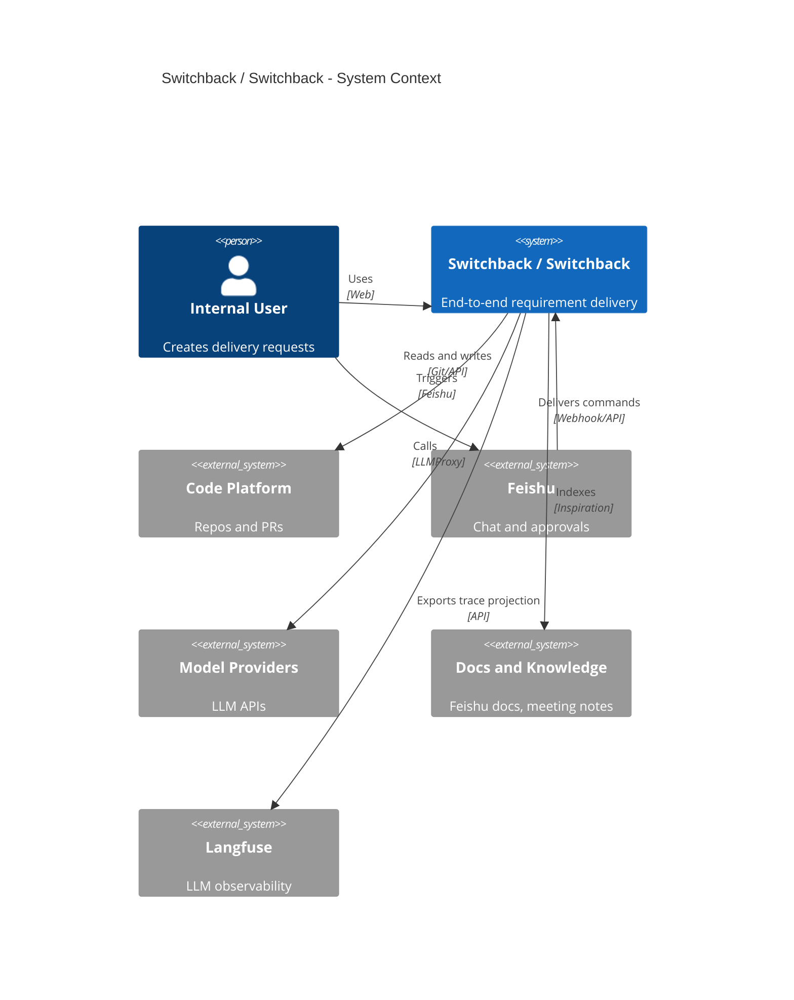
```mermaid
C4Context
    accTitle: Switchback System Context
    accDescr: C4 context diagram showing internal users, Switchback, and external platform dependencies.

    title Switchback / Switchback - System Context

    Person(user, "Internal User", "Creates delivery requests")
    System(switchback, "Switchback / Switchback", "End-to-end requirement delivery")
    System_Ext(code, "Code Platform", "Repos and PRs")
    System_Ext(feishu, "Feishu", "Chat and approvals")
    System_Ext(model, "Model Providers", "LLM APIs")
    System_Ext(knowledge, "Docs and Knowledge", "Feishu docs, meeting notes")
    System_Ext(langfuse, "Langfuse", "LLM observability")

    Rel(user, switchback, "Uses", "Web")
    Rel(user, feishu, "Triggers", "Feishu")
    Rel(feishu, switchback, "Delivers commands", "Webhook/API")
    Rel(switchback, code, "Reads and writes", "Git/API")
    Rel(switchback, model, "Calls", "LLMProxy")
    Rel(switchback, knowledge, "Indexes", "Inspiration")
    Rel(switchback, langfuse, "Exports trace projection", "API")

    UpdateRelStyle(user, switchback, $offsetY="-30", $offsetX="-40")
    UpdateRelStyle(user, feishu, $offsetY="-30", $offsetX="10")
    UpdateRelStyle(feishu, switchback, $offsetY="20", $offsetX="-20")
    UpdateRelStyle(switchback, code, $offsetY="-30", $offsetX="-20")
    UpdateRelStyle(switchback, model, $offsetY="-30", $offsetX="10")
    UpdateRelStyle(switchback, knowledge, $offsetY="20", $offsetX="10")
    UpdateRelStyle(switchback, langfuse, $offsetY="40", $offsetX="20")
```

## Container View

```mermaid
C4Container
    accTitle: Switchback Container View
    accDescr: Container diagram showing Switchback entry, domain services, execution runtime, eventing, and storage dependencies.

    Person(user, "Internal User", "Requests delivery")

    Container_Boundary(entry, "Entry and Output") {
        Container(frontend, "Frontend", "Web UI", "Renders projections")
        Container(gateway, "Gateway", "Go API", "Sync entry")
        Container(frontier, "Frontier", "Realtime/BFF", "Projection and SSE")
        Container(delivery, "Delivery", "Go service", "Feishu adapter")
    }

    Container_Boundary(core, "Core Domain") {
        Container(assistant, "Assistant", "Go service", "Clarify and dispatch")
        Container(task, "Task Orchestration", "Go service", "PostgreSQL Saga and durable wakeups")
        Container(worker, "Worker Runtime", "Go service", "Agent execution")
        Container(eventcenter, "EventCenter", "Go service", "Events and projections")
        Container(evolution, "Evolution", "Go service", "Truth lifecycle")
        Container(skilling, "Skilling", "Go service", "Capabilities")
        Container(llmproxy, "LLMProxy Control", "Go", "Model policy")
    }

    Container_Boundary(data, "Data and Infra") {
        ContainerDb(rdbms, "RDBMS", "SQL", "Aggregates, SagaWakeup and outbox")
        ContainerQueue(mq, "Event Transport", "Outbox / MQ", "P0 polling, P1 broker")
        ContainerDb(object_store, "ObjectStore", "Local / S3", "JSONL and artifacts")
        ContainerDb(openviking, "OpenViking", "Serving projection", "Approved active Truth and Resource indexes")
        ContainerDb(langfuse, "Langfuse", "Observability", "Trace projection")
    }

    Rel(user, frontend, "Uses", "HTTPS")
    Rel(frontend, gateway, "Sends commands", "HTTPS")
    Rel(user, delivery, "Uses", "Feishu")
    Rel(gateway, assistant, "Commands", "MQ/API")
    Rel(delivery, assistant, "Clarifies", "MQ/API")
    Rel(delivery, task, "Creates direct task", "MQ/API")
    Rel(assistant, task, "Submits TaskSpec", "Command")
    Rel(task, worker, "Starts runs", "Command")
    Rel(worker, skilling, "Loads capabilities", "API")
    Rel(assistant, skilling, "Reads skills", "API")
    Rel(assistant, llmproxy, "Calls models", "API")
    Rel(worker, llmproxy, "Resolves model access", "API")
    Rel(assistant, object_store, "Writes turns", "OSS")
    Rel(worker, object_store, "Writes trace", "OSS")
    Rel(worker, langfuse, "Exports trace", "API")
    Rel(llmproxy, langfuse, "Exports model observations", "API")
    Rel(evolution, object_store, "Reads evidence", "OSS")
    Rel(evolution, openviking, "Projects approved active context", "API")
    Rel(assistant, mq, "Publishes", "Events")
    Rel(task, mq, "Publishes", "Events")
    Rel(worker, mq, "Publishes", "Events")
    Rel(mq, eventcenter, "Delivers", "Events")
    Rel(eventcenter, frontier, "Updates projections", "Internal API")
    Rel(eventcenter, delivery, "Notifies", "Events")
    Rel(frontier, frontend, "Streams", "SSE")
    Rel(assistant, rdbms, "Persists", "SQL")
    Rel(task, rdbms, "Persists", "SQL")
    Rel(worker, rdbms, "Persists", "SQL")
    Rel(evolution, rdbms, "Persists", "SQL")
    Rel(skilling, rdbms, "Persists", "SQL")
```

## Web Assistant To Worker Sequence

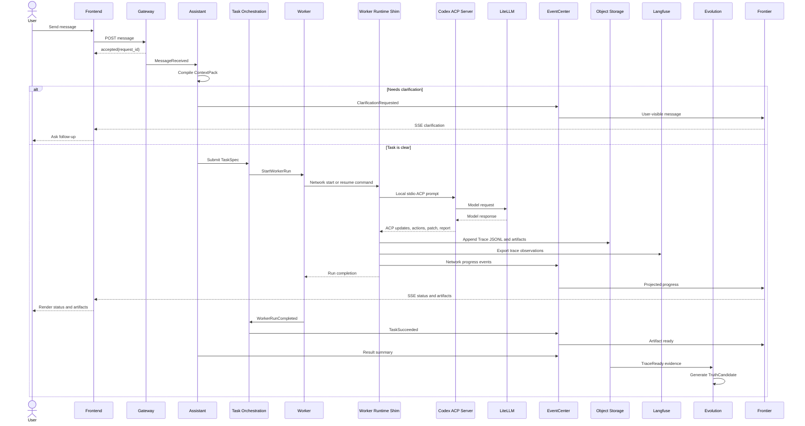
```mermaid
sequenceDiagram
    accTitle: Web Assistant To Worker
    accDescr: Sequence from a web message through Assistant clarification, TaskSpec creation, Worker execution, events, artifacts, and Evolution.

    actor User
    participant Frontend
    participant Gateway
    participant Assistant
    participant Task as Task Orchestration
    participant Worker
    participant Runtime as Worker Runtime Shim
    participant Agent as Codex ACP Server
    participant LiteLLM
    participant EventCenter
    participant Store as Object Storage
    participant Langfuse
    participant Evolution
    participant Frontier

    User->>Frontend: Send message
    Frontend->>Gateway: POST message
    Gateway-->>Frontend: accepted(request_id)
    Gateway->>Assistant: MessageReceived
    Assistant->>Assistant: Compile ContextPack
    alt Needs clarification
        Assistant->>EventCenter: ClarificationRequested
        EventCenter->>Frontier: User-visible message
        Frontier-->>Frontend: SSE clarification
        Frontend-->>User: Ask follow-up
    else Task is clear
        Assistant->>Task: Submit TaskSpec
        Task->>Worker: StartWorkerRun
        Worker->>Runtime: Network start or resume command
        Runtime->>Agent: Local stdio ACP prompt
        Agent->>LiteLLM: Model request
        LiteLLM-->>Agent: Model response
        Agent-->>Runtime: ACP updates, actions, patch, report
        Runtime->>Store: Append Trace JSONL and artifacts
        Runtime->>Langfuse: Export trace observations
        Runtime->>EventCenter: Network progress events
        Runtime-->>Worker: Run completion
        EventCenter->>Frontier: Projected progress
        Frontier-->>Frontend: SSE status and artifacts
        Frontend-->>User: Render status and artifacts
        Worker->>Task: WorkerRunCompleted
        Task->>EventCenter: TaskSucceeded
        EventCenter->>Frontier: Artifact ready
        Assistant->>EventCenter: Result summary
        Store->>Evolution: TraceReady evidence
        Evolution->>Evolution: Generate TruthCandidate
    end
```

## Assistant Readiness State Machine

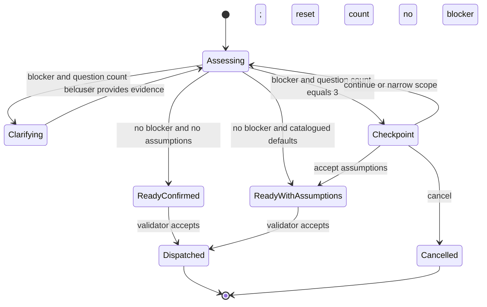
```mermaid
stateDiagram-v2
    accTitle: Assistant Task Readiness
    accDescr: Assistant repeatedly assesses seven readiness dimensions, asks one blocking question at a time, forces a checkpoint after three questions, and dispatches only after blockers are gone and deterministic validation passes.

    [*] --> Assessing
    Assessing --> Clarifying: blocker and question count below 3
    Clarifying --> Assessing: user provides evidence
    Assessing --> Checkpoint: blocker and question count equals 3
    Checkpoint --> Assessing: continue or narrow scope; reset count
    Checkpoint --> Cancelled: cancel
    Assessing --> ReadyConfirmed: no blocker and no assumptions
    Assessing --> ReadyWithAssumptions: no blocker and catalogued defaults
    Checkpoint --> ReadyWithAssumptions: accept assumptions; no blocker
    ReadyConfirmed --> Dispatched: validator accepts
    ReadyWithAssumptions --> Dispatched: validator accepts
    Dispatched --> [*]
    Cancelled --> [*]
```

## Worker Runtime Control Sequence

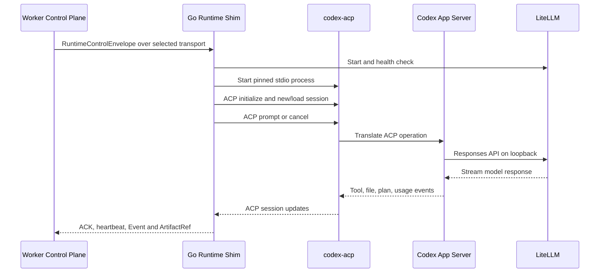
```mermaid
sequenceDiagram
    accTitle: Worker Runtime Control Flow
    accDescr: The backend controls a container-side Go shim over the network, while the shim uses local stdio ACP to drive codex-acp and Codex through a loopback LiteLLM process.

    participant Control as Worker Control Plane
    participant Shim as Go Runtime Shim
    participant Adapter as codex-acp
    participant Codex as Codex App Server
    participant LiteLLM

    Control->>Shim: RuntimeControlEnvelope over selected transport
    Shim->>LiteLLM: Start and health check
    Shim->>Adapter: Start pinned stdio process
    Shim->>Adapter: ACP initialize and new/load session
    Shim->>Adapter: ACP prompt or cancel
    Adapter->>Codex: Translate ACP operation
    Codex->>LiteLLM: Responses API on loopback
    LiteLLM-->>Codex: Stream model response
    Codex-->>Adapter: Tool, file, plan, usage events
    Adapter-->>Shim: ACP session updates
    Shim-->>Control: ACK, heartbeat, Event and ArtifactRef
```

## Worker Control Transport Fallback

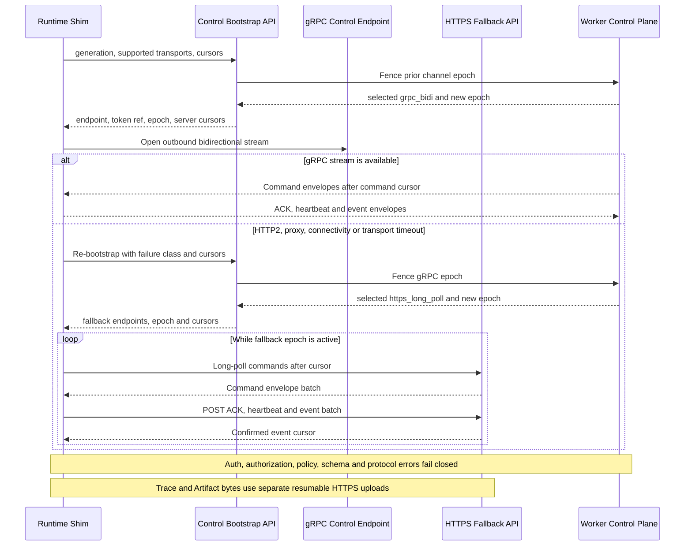
```mermaid
sequenceDiagram
    accTitle: Worker Control Transport Negotiation And Fallback
    accDescr: The runtime shim prefers one outbound gRPC bidirectional stream, falls back to HTTPS long polling and event batches only for transport failures, and resumes from shared logical cursors under a newly fenced channel epoch.

    participant Shim as Runtime Shim
    participant Bootstrap as Control Bootstrap API
    participant GRPC as gRPC Control Endpoint
    participant HTTPS as HTTPS Fallback API
    participant Control as Worker Control Plane

    Shim->>Bootstrap: generation, supported transports, cursors
    Bootstrap->>Control: Fence prior channel epoch
    Control-->>Bootstrap: selected grpc_bidi and new epoch
    Bootstrap-->>Shim: endpoint, token ref, epoch, server cursors
    Shim->>GRPC: Open outbound bidirectional stream
    alt gRPC stream is available
        Control-->>Shim: Command envelopes after command cursor
        Shim-->>Control: ACK, heartbeat and event envelopes
    else HTTP2, proxy, connectivity or transport timeout
        Shim->>Bootstrap: Re-bootstrap with failure class and cursors
        Bootstrap->>Control: Fence gRPC epoch
        Control-->>Bootstrap: selected https_long_poll and new epoch
        Bootstrap-->>Shim: fallback endpoints, epoch and cursors
        loop While fallback epoch is active
            Shim->>HTTPS: Long-poll commands after cursor
            HTTPS-->>Shim: Command envelope batch
            Shim->>HTTPS: POST ACK, heartbeat and event batch
            HTTPS-->>Shim: Confirmed event cursor
        end
    end
    Note over Shim,Control: Auth, authorization, policy, schema and protocol errors fail closed
    Note over Shim,HTTPS: Trace and Artifact bytes use separate resumable HTTPS uploads
```

## Runtime Health And Recovery State

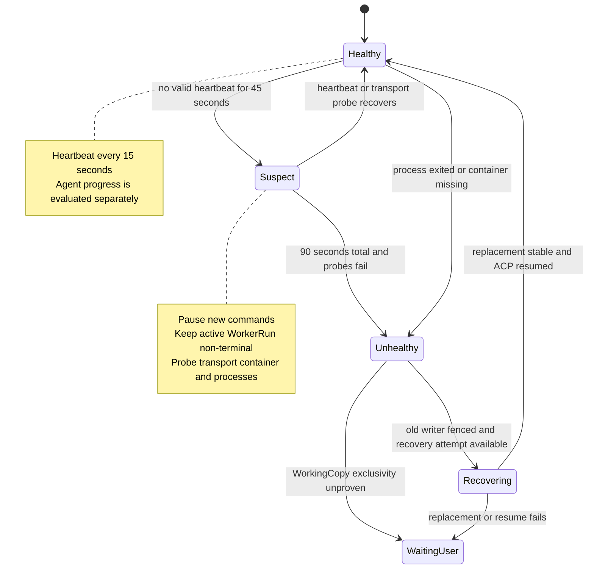
```mermaid
stateDiagram-v2
    accTitle: Runtime Health And Recovery States
    accDescr: A runtime emits heartbeat every fifteen seconds, becomes suspect after forty-five seconds, becomes unhealthy after ninety seconds or an explicit process failure, and then enters a separately governed recovery incident while Agent progress remains an independent signal.

    [*] --> Healthy
    Healthy --> Suspect: no valid heartbeat for 45 seconds
    Suspect --> Healthy: heartbeat or transport probe recovers
    Suspect --> Unhealthy: 90 seconds total and probes fail
    Healthy --> Unhealthy: process exited or container missing
    Unhealthy --> Recovering: old writer fenced and recovery attempt available
    Unhealthy --> WaitingUser: WorkingCopy exclusivity unproven
    Recovering --> Healthy: replacement stable and ACP resumed
    Recovering --> WaitingUser: replacement or resume fails
    Note right of Suspect
        Pause new commands
        Keep active WorkerRun non-terminal
        Probe transport container and processes
    end note
    Note right of Healthy
        Heartbeat every 15 seconds
        Agent progress is evaluated separately
    end note
```

## Runtime Automatic Recovery

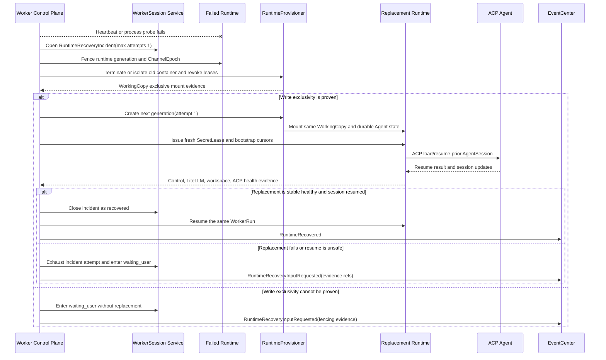
```mermaid
sequenceDiagram
    accTitle: Single Automatic Runtime Recovery Per Incident
    accDescr: The control plane fences a failed runtime, creates one replacement generation with the same durable session state, resumes the prior ACP AgentSession, and escalates to the user instead of crash-looping when recovery is unsafe.

    participant Control as Worker Control Plane
    participant Session as WorkerSession Service
    participant Old as Failed Runtime
    participant Provisioner as RuntimeProvisioner
    participant New as Replacement Runtime
    participant Agent as ACP Agent
    participant EventCenter

    Control--xOld: Heartbeat or process probe fails
    Control->>Session: Open RuntimeRecoveryIncident(max attempts 1)
    Control->>Old: Fence runtime generation and ChannelEpoch
    Control->>Provisioner: Terminate or isolate old container and revoke leases
    Provisioner-->>Control: WorkingCopy exclusive mount evidence
    alt Write exclusivity is proven
        Control->>Provisioner: Create next generation(attempt 1)
        Provisioner->>New: Mount same WorkingCopy and durable Agent state
        Control->>New: Issue fresh SecretLease and bootstrap cursors
        New->>Agent: ACP load/resume prior AgentSession
        Agent-->>New: Resume result and session updates
        New-->>Control: Control, LiteLLM, workspace, ACP health evidence
        alt Replacement is stable healthy and session resumed
            Control->>Session: Close incident as recovered
            Control->>New: Resume the same WorkerRun
            Control->>EventCenter: RuntimeRecovered
        else Replacement fails or resume is unsafe
            Control->>Session: Exhaust incident attempt and enter waiting_user
            Control->>EventCenter: RuntimeRecoveryInputRequested(evidence refs)
        end
    else Write exclusivity cannot be proven
        Control->>Session: Enter waiting_user without replacement
        Control->>EventCenter: RuntimeRecoveryInputRequested(fencing evidence)
    end
```

## Feishu Delivery To Worker Sequence

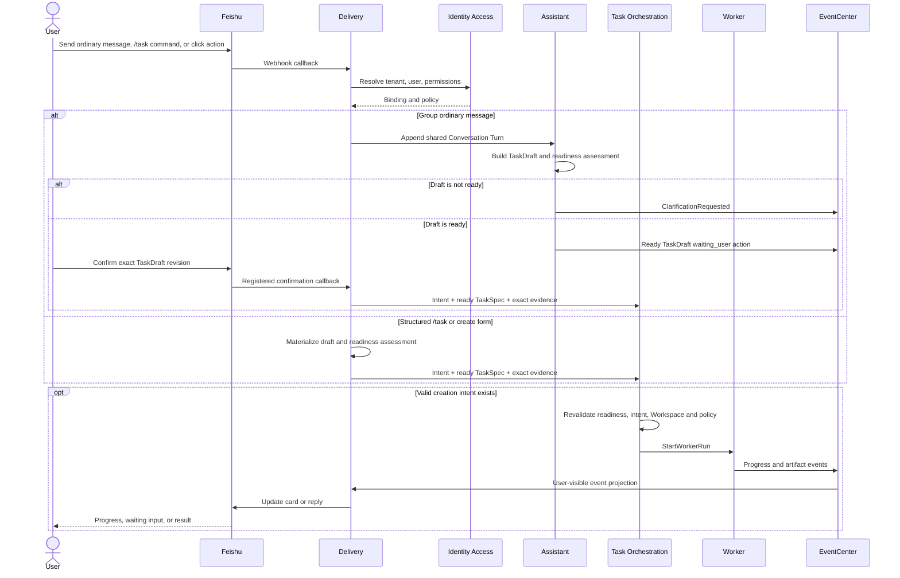
```mermaid
sequenceDiagram
    accTitle: Feishu Delivery To Worker
    accDescr: Group ordinary messages enter Assistant while structured task surfaces and exact ready-draft confirmations can create a Task through independent readiness and intent gates.

    actor User
    participant Feishu
    participant Delivery
    participant Identity as Identity Access
    participant Assistant
    participant Task as Task Orchestration
    participant Worker
    participant EventCenter

    User->>Feishu: Send ordinary message, /task command, or click action
    Feishu->>Delivery: Webhook callback
    Delivery->>Identity: Resolve tenant, user, permissions
    Identity-->>Delivery: Binding and policy
    alt Group ordinary message
        Delivery->>Assistant: Append shared Conversation Turn
        Assistant->>Assistant: Build TaskDraft and readiness assessment
        alt Draft is not ready
            Assistant->>EventCenter: ClarificationRequested
        else Draft is ready
            Assistant->>EventCenter: Ready TaskDraft waiting_user action
            User->>Feishu: Confirm exact TaskDraft revision
            Feishu->>Delivery: Registered confirmation callback
            Delivery->>Task: Intent + ready TaskSpec + exact evidence
        end
    else Structured /task or create form
        Delivery->>Delivery: Materialize draft and readiness assessment
        Delivery->>Task: Intent + ready TaskSpec + exact evidence
    end
    opt Valid creation intent exists
        Task->>Task: Revalidate readiness, intent, Workspace and policy
        Task->>Worker: StartWorkerRun
        Worker->>EventCenter: Progress and artifact events
        EventCenter->>Delivery: User-visible event projection
        Delivery->>Feishu: Update card or reply
        Feishu-->>User: Progress, waiting input, or result
    end
```

## Direct Worker Detail Interaction

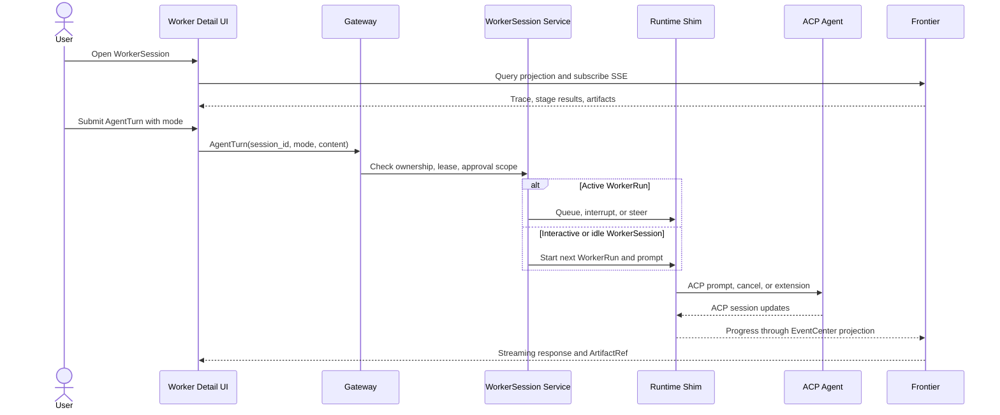
```mermaid
sequenceDiagram
    accTitle: Direct Worker Detail Interaction
    accDescr: A user inspects a WorkerSession timeline and sends prompt, queue, interrupt, or steer controls directly to the active agent without returning through Assistant.

    actor User
    participant UI as Worker Detail UI
    participant Gateway
    participant Session as WorkerSession Service
    participant Shim as Runtime Shim
    participant Agent as ACP Agent
    participant Frontier

    User->>UI: Open WorkerSession
    UI->>Frontier: Query projection and subscribe SSE
    Frontier-->>UI: Trace, stage results, artifacts
    User->>UI: Submit AgentTurn with mode
    UI->>Gateway: AgentTurn(session_id, mode, content)
    Gateway->>Session: Check ownership, lease, approval scope
    alt Active WorkerRun
        Session->>Shim: Queue, interrupt, or steer
    else Interactive or idle WorkerSession
        Session->>Shim: Start next WorkerRun and prompt
    end
    Shim->>Agent: ACP prompt, cancel, or extension
    Agent-->>Shim: ACP session updates
    Shim-->>Frontier: Progress through EventCenter projection
    Frontier-->>UI: Streaming response and ArtifactRef
```

## Explicit New Task Creation From Worker Context

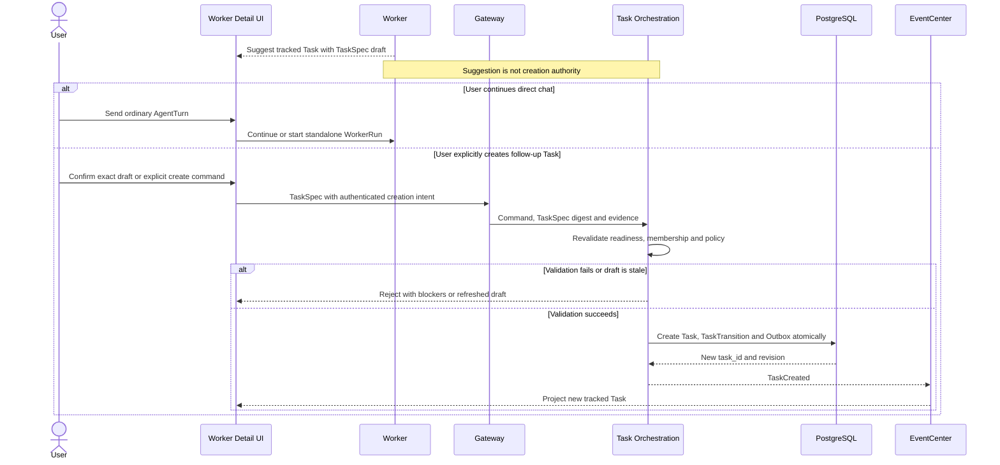
```mermaid
sequenceDiagram
    accTitle: Explicit New Task Creation From Worker Context
    accDescr: Worker may suggest tracked work, but only authenticated explicit user intent can create a lightweight Task without changing the source standalone WorkerRun.

    actor User
    participant UI as Worker Detail UI
    participant Worker
    participant Gateway
    participant Task as Task Orchestration
    participant DB as PostgreSQL
    participant EventCenter

    Worker-->>UI: Suggest tracked Task with TaskSpec draft
    Note over Worker,Task: Suggestion is not creation authority
    alt User continues direct chat
        User->>UI: Send ordinary AgentTurn
        UI->>Worker: Continue or start standalone WorkerRun
    else User explicitly creates follow-up Task
        User->>UI: Confirm exact draft or explicit create command
        UI->>Gateway: TaskSpec with authenticated creation intent
        Gateway->>Task: Command, TaskSpec digest and evidence
        Task->>Task: Revalidate readiness, membership and policy
        alt Validation fails or draft is stale
            Task-->>UI: Reject with blockers or refreshed draft
        else Validation succeeds
            Task->>DB: Create Task, TaskTransition and Outbox atomically
            DB-->>Task: New task_id and revision
            Task-->>EventCenter: TaskCreated
            EventCenter-->>UI: Project new tracked Task
        end
    end
```

## Isolated Workspace Change Application

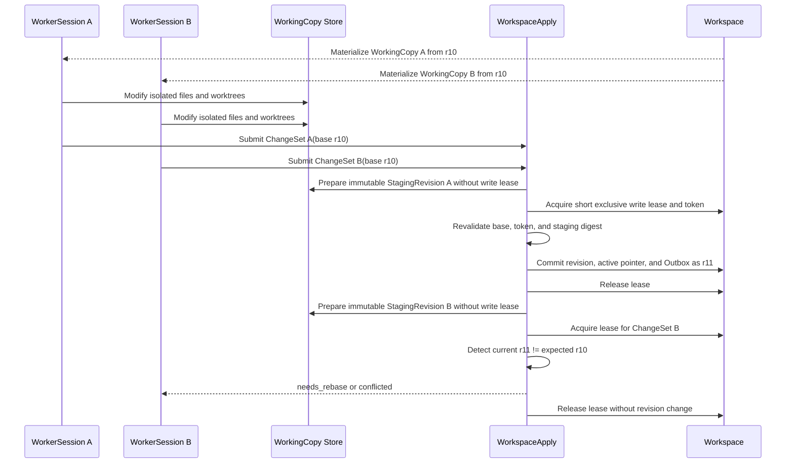
```mermaid
sequenceDiagram
    accTitle: Isolated Workspace Change Application
    accDescr: Parallel WorkerSessions modify isolated WorkingCopies and submit ChangeSets, while WorkspaceApply serializes authoritative revision changes and rejects stale bases without partial updates.

    participant A as WorkerSession A
    participant B as WorkerSession B
    participant Copies as WorkingCopy Store
    participant Apply as WorkspaceApply
    participant Workspace

    Workspace-->>A: Materialize WorkingCopy A from r10
    Workspace-->>B: Materialize WorkingCopy B from r10
    A->>Copies: Modify isolated files and worktrees
    B->>Copies: Modify isolated files and worktrees
    A->>Apply: Submit ChangeSet A(base r10)
    B->>Apply: Submit ChangeSet B(base r10)
    Apply->>Copies: Prepare immutable StagingRevision A without write lease
    Apply->>Workspace: Acquire short exclusive write lease and token
    Apply->>Apply: Revalidate base, token, and staging digest
    Apply->>Workspace: Commit revision, active pointer, and Outbox as r11
    Apply->>Workspace: Release lease
    Apply->>Copies: Prepare immutable StagingRevision B without write lease
    Apply->>Workspace: Acquire lease for ChangeSet B
    Apply->>Apply: Detect current r11 != expected r10
    Apply-->>B: needs_rebase or conflicted
    Apply->>Workspace: Release lease without revision change
```

## Evolution Truth Loop

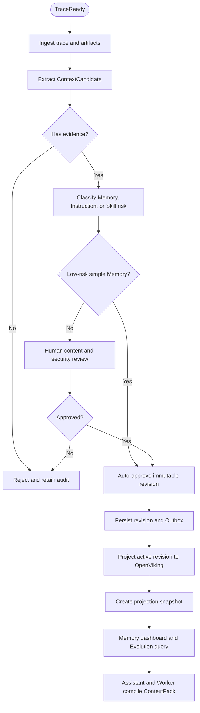
```mermaid
flowchart TB
    accTitle: Evolution Truth Lifecycle
    accDescr: Flow from completed traces to TruthCandidate generation, review, publication, and future context loading.

    trace([TraceReady]) --> ingest[Ingest trace and artifacts]
    ingest --> extract[Extract ContextCandidate]
    extract --> evidence{Has evidence?}
    evidence -->|No| reject[Reject and retain audit]
    evidence -->|Yes| classify[Classify Memory, Instruction, or Skill risk]
    classify --> policy{Low-risk simple Memory?}
    policy -->|Yes| approve[Auto-approve immutable revision]
    policy -->|No| review[Human content and security review]
    review --> decision{Approved?}
    decision -->|No| reject
    decision -->|Yes| approve
    approve --> outbox[Persist revision and Outbox]
    outbox --> projection[Project active revision to OpenViking]
    projection --> snapshot[Create projection snapshot]
    snapshot --> dashboard[Memory dashboard and Evolution query]
    dashboard --> assistant[Assistant and Worker compile ContextPack]
```

## Memory Auto-Publication Gate

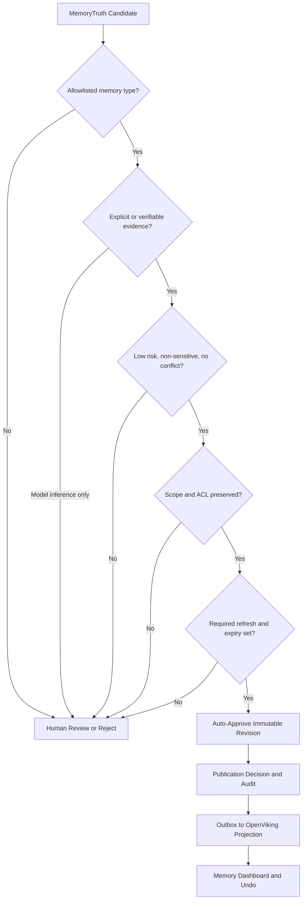
```mermaid
flowchart TB
    accTitle: Memory Auto-Publication Gate
    accDescr: A Memory candidate can auto-publish only when its type is allowlisted, its evidence is explicit or verifiable, and deterministic risk, scope, conflict, sensitivity, and lifecycle checks all pass.

    candidate["MemoryTruth Candidate"] --> type_gate{"Allowlisted memory type?"}
    type_gate -->|"No"| review["Human Review or Reject"]
    type_gate -->|"Yes"| evidence_gate{"Explicit or verifiable evidence?"}
    evidence_gate -->|"Model inference only"| review
    evidence_gate -->|"Yes"| risk_gate{"Low risk, non-sensitive, no conflict?"}
    risk_gate -->|"No"| review
    risk_gate -->|"Yes"| scope_gate{"Scope and ACL preserved?"}
    scope_gate -->|"No"| review
    scope_gate -->|"Yes"| lifecycle_gate{"Required refresh and expiry set?"}
    lifecycle_gate -->|"No"| review
    lifecycle_gate -->|"Yes"| approve["Auto-Approve Immutable Revision"]
    approve --> audit["Publication Decision and Audit"]
    audit --> outbox["Outbox to OpenViking Projection"]
    outbox --> dashboard["Memory Dashboard and Undo"]
```

## Memory Governance Surfaces

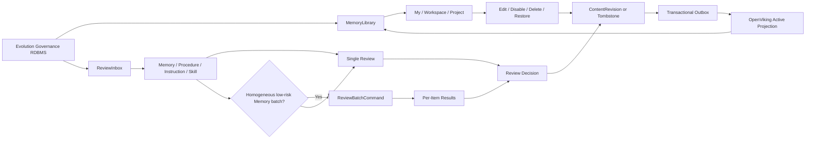
```mermaid
flowchart LR
    accTitle: Memory Governance Surfaces
    accDescr: Active and historical memories are managed in Memory Library, pending governed content is reviewed in typed inbox lanes, and every edit, review, batch action, projection change, and partial failure remains explicit and auditable.

    evolution["Evolution Governance RDBMS"] --> library["MemoryLibrary"]
    evolution --> inbox["ReviewInbox"]
    library --> scopes["My / Workspace / Project"]
    scopes --> actions["Edit / Disable / Delete / Restore"]
    actions --> revision["ContentRevision or Tombstone"]
    inbox --> lanes["Memory / Procedure / Instruction / Skill"]
    lanes --> single["Single Review"]
    lanes --> batch_gate{"Homogeneous low-risk Memory batch?"}
    batch_gate -->|"Yes"| batch["ReviewBatchCommand"]
    batch_gate -->|"No"| single
    single --> decision["Review Decision"]
    batch --> item_results["Per-Item Results"]
    item_results --> decision
    decision --> revision
    revision --> outbox["Transactional Outbox"]
    outbox --> projection["OpenViking Active Projection"]
    projection --> library
```

## Task State Machine

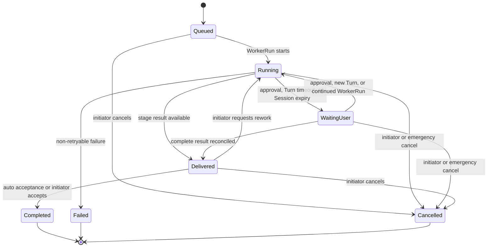
```mermaid
stateDiagram-v2
    accTitle: Task State Machine
    accDescr: Lightweight Switchback Task lifecycle. AgentTurn timeout is a resumable waiting reason, not a Task terminal state.

    [*] --> Queued
    Queued --> Running: WorkerRun starts
    Queued --> Cancelled: initiator cancels
    Running --> WaitingUser: approval, Turn timeout, or Session expiry
    WaitingUser --> Running: approval, new Turn, or continued WorkerRun
    Running --> Delivered: stage result available
    WaitingUser --> Delivered: complete result reconciled
    Running --> Failed: non-retryable failure
    Running --> Cancelled: initiator or emergency cancel
    WaitingUser --> Cancelled: initiator or emergency cancel
    Delivered --> Running: initiator requests rework
    Delivered --> Completed: auto acceptance or initiator accepts
    Delivered --> Cancelled: initiator cancels
    Completed --> [*]
    Failed --> [*]
    Cancelled --> [*]
```

## WorkerRun State Machine

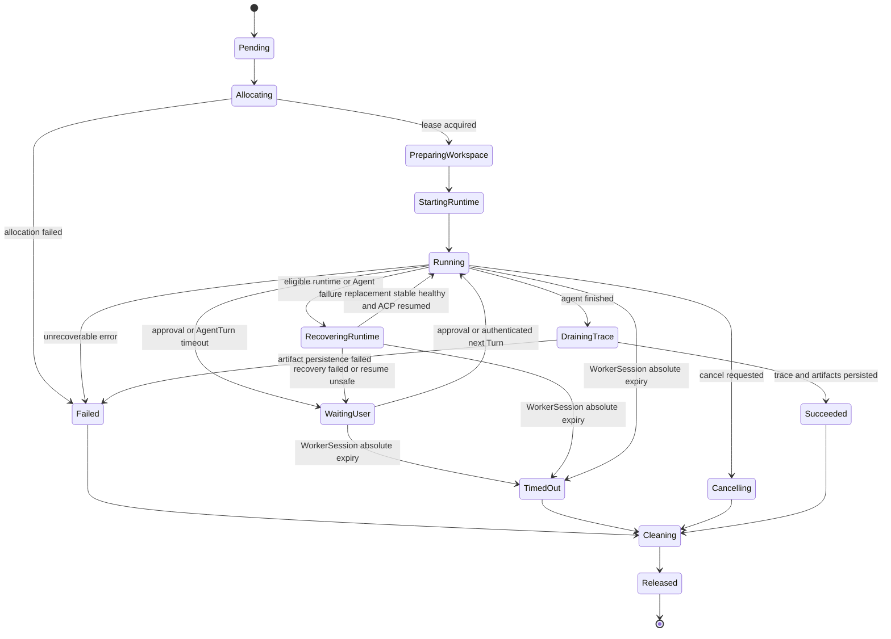
```mermaid
stateDiagram-v2
    accTitle: WorkerRun State Machine
    accDescr: State machine for one WorkerRun. A timed-out AgentTurn leaves a resumable Run waiting for the user; only Session absolute expiry times out the Run.

    [*] --> Pending
    Pending --> Allocating
    Allocating --> PreparingWorkspace: lease acquired
    Allocating --> Failed: allocation failed
    PreparingWorkspace --> StartingRuntime
    StartingRuntime --> Running
    Running --> WaitingUser: approval or AgentTurn timeout
    WaitingUser --> Running: approval or authenticated next Turn
    Running --> RecoveringRuntime: eligible runtime or Agent failure
    RecoveringRuntime --> Running: replacement stable healthy and ACP resumed
    RecoveringRuntime --> WaitingUser: recovery failed or resume unsafe
    WaitingUser --> TimedOut: WorkerSession absolute expiry
    RecoveringRuntime --> TimedOut: WorkerSession absolute expiry
    Running --> DrainingTrace: agent finished
    Running --> Failed: unrecoverable error
    Running --> TimedOut: WorkerSession absolute expiry
    Running --> Cancelling: cancel requested
    DrainingTrace --> Succeeded: trace and artifacts persisted
    DrainingTrace --> Failed: artifact persistence failed
    Failed --> Cleaning
    TimedOut --> Cleaning
    Cancelling --> Cleaning
    Succeeded --> Cleaning
    Cleaning --> Released
    Released --> [*]
```

## AgentTurn State Machine

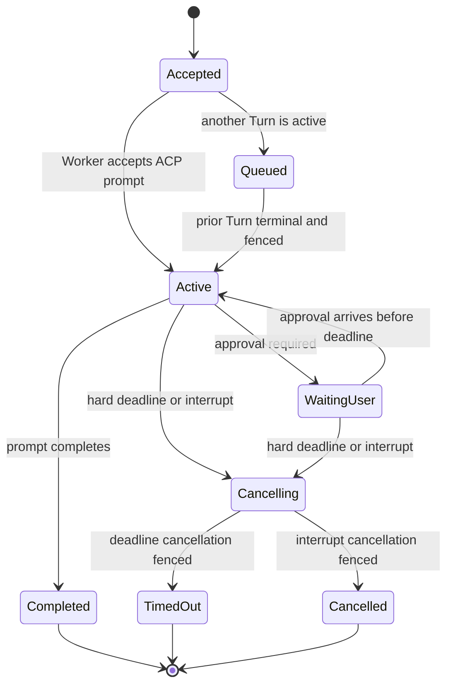
```mermaid
stateDiagram-v2
    accTitle: AgentTurn State Machine
    accDescr: Each actual ACP prompt gets an independent fixed 24-hour deadline that continues through approval waits, disconnects, and runtime recovery.

    [*] --> Accepted
    Accepted --> Queued: another Turn is active
    Accepted --> Active: Worker accepts ACP prompt
    Queued --> Active: prior Turn terminal and fenced
    Active --> WaitingUser: approval required
    WaitingUser --> Active: approval arrives before deadline
    Active --> Cancelling: hard deadline or interrupt
    WaitingUser --> Cancelling: hard deadline or interrupt
    Active --> Completed: prompt completes
    Cancelling --> TimedOut: deadline cancellation fenced
    Cancelling --> Cancelled: interrupt cancellation fenced
    Completed --> [*]
    TimedOut --> [*]
    Cancelled --> [*]
```

## Tool Metadata Resolution Flow

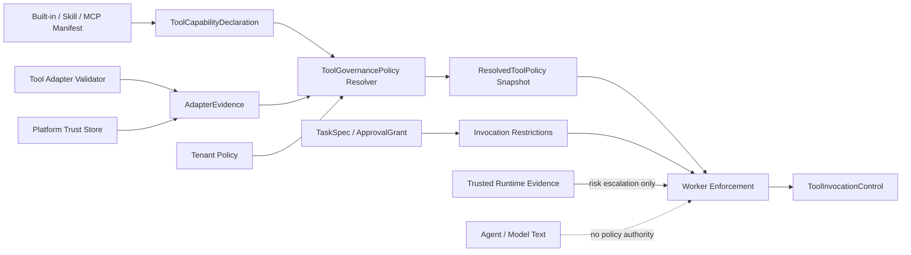
```mermaid
flowchart LR
    accTitle: Tool Metadata Resolution Flow
    accDescr: Tool manifests declare intent, adapters provide technical evidence, Capability and Skilling policy resolves an immutable policy, and Worker enforces only further restrictions while Agent text has no authority.

    manifest["Built-in / Skill / MCP Manifest"] --> declaration["ToolCapabilityDeclaration"]
    adapter["Tool Adapter Validator"] --> evidence["AdapterEvidence"]
    trust_store["Platform Trust Store"] --> evidence
    declaration --> policy["ToolGovernancePolicy Resolver"]
    evidence --> policy
    tenant["Tenant Policy"] --> policy
    policy --> resolved["ResolvedToolPolicy Snapshot"]
    task["TaskSpec / ApprovalGrant"] --> restriction["Invocation Restrictions"]
    resolved --> worker["Worker Enforcement"]
    restriction --> worker
    runtime["Trusted Runtime Evidence"] -->|"risk escalation only"| worker
    agent["Agent / Model Text"] -.->|"no policy authority"| worker
    worker --> invocation["ToolInvocationControl"]
```

## ToolInvocation Cancellation State Machine

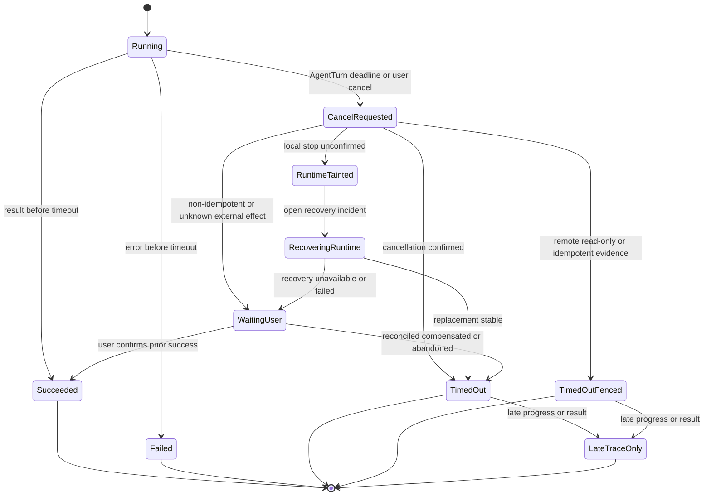
```mermaid
stateDiagram-v2
    accTitle: Tool Cancellation And Escalation
    accDescr: A timed-out Tool is cancelled using its declared capability, then either completes safely, taints the local runtime, continues under a fenced safe remote result, or waits for user reconciliation of uncertain external effects.

    [*] --> Running
    Running --> Succeeded: result before timeout
    Running --> Failed: error before timeout
    Running --> CancelRequested: AgentTurn deadline or user cancel
    CancelRequested --> TimedOut: cancellation confirmed
    CancelRequested --> RuntimeTainted: local stop unconfirmed
    CancelRequested --> TimedOutFenced: remote read-only or idempotent evidence
    CancelRequested --> WaitingUser: non-idempotent or unknown external effect
    RuntimeTainted --> RecoveringRuntime: open recovery incident
    RecoveringRuntime --> TimedOut: replacement stable
    RecoveringRuntime --> WaitingUser: recovery unavailable or failed
    WaitingUser --> TimedOut: reconciled compensated or abandoned
    WaitingUser --> Succeeded: user confirms prior success
    TimedOut --> LateTraceOnly: late progress or result
    TimedOutFenced --> LateTraceOnly: late progress or result
    Succeeded --> [*]
    Failed --> [*]
    TimedOut --> [*]
    TimedOutFenced --> [*]
    LateTraceOnly --> [*]
```

## WorkerSession Lifecycle

```mermaid
stateDiagram-v2
    accTitle: Interactive WorkerSession Lifecycle
    accDescr: A WorkerSession remains interactive across completed WorkerRuns, allows one automatic runtime replacement per incident, pauses its idle countdown while waiting for user input, and eventually closes on idle, absolute lifetime, explicit close, or unrecoverable loss.

    [*] --> Allocating
    Allocating --> Interactive: runtime ready
    Interactive --> Running: task or AgentTurn starts run
    Running --> Interactive: stage completed
    Running --> WaitingUser: approval or external action
    Running --> Recovering: eligible runtime or Agent failure
    Recovering --> Running: first replacement stable healthy and ACP resumed
    Recovering --> WaitingUser: recovery attempt exhausted or resume unsafe
    WaitingUser --> Running: approved or input supplied
    WaitingUser --> Interactive: operation declined and run ends
    Interactive --> Idle: no activity
    Idle --> Interactive: valid interaction before timeout
    Idle --> Expired: 48 hour idle timeout
    WaitingUser --> Expired: 14 day absolute timeout
    Recovering --> Expired: 14 day absolute timeout
    Running --> Expired: 14 day absolute timeout
    Interactive --> Expired: 14 day absolute timeout
    Interactive --> Closed: user closes session
    WaitingUser --> Lost: recovery abandoned
    Expired --> [*]
    Closed --> [*]
    Lost --> [*]
```

## Conceptual Data Model

```mermaid
erDiagram
    accTitle: Switchback Conceptual Data Model
    accDescr: Conceptual entity relationships across conversation, task, worker execution, artifacts, events, and Truth.

    TENANT ||--o{ TENANT_MEMBERSHIP : "has members"
    USER ||--o{ TENANT_MEMBERSHIP : "joins tenants"
    TENANT ||--o{ WORKSPACE : "contains"
    WORKSPACE ||--o{ WORKSPACE_MEMBERSHIP : "authorizes"
    USER ||--o{ WORKSPACE_MEMBERSHIP : "holds roles"
    USER ||--o{ CONVERSATION : "creates"
    CONVERSATION ||--o{ CONVERSATION_PARTICIPANT : "has participants"
    USER ||--o{ CONVERSATION_PARTICIPANT : "acts in"
    CONVERSATION ||--o{ TURN : "contains"
    CONVERSATION ||--o{ TASK : "creates"
    TASK ||--o{ TASK_TRANSITION : "advances through"
    TASK ||--o{ SCHEDULED_COMMAND : "re-evaluates from"
    USER ||--o{ WORKER_SESSION : "owns"
    WORKSPACE ||--|{ WORKER_SESSION : "hosts"
    WORKSPACE ||--|{ WORKSPACE_REVISION : "versions"
    WORKSPACE ||--o{ REPOSITORY_CHECKOUT : "contains"
    WORKER_SESSION ||--|| WORKING_COPY : "owns"
    WORKING_COPY ||--o{ CHANGE_SET : "produces"
    CHANGE_SET ||--o| WORKSPACE_APPLY : "applies as"
    WORKSPACE_APPLY }o--|| WORKSPACE_REVISION : "creates"
    TASK ||--o{ WORKER_RUN : "executes as"
    WORKER_SESSION ||--o{ WORKER_RUN : "runs"
    WORKER_SESSION ||--o{ AGENT_TURN : "receives"
    WORKER_SESSION ||--o{ RUNTIME_INSTANCE : "recreates"
    RUNTIME_INSTANCE ||--o{ RUNTIME_HEARTBEAT : "emits"
    WORKER_SESSION ||--o{ RUNTIME_RECOVERY_INCIDENT : "opens"
    RUNTIME_RECOVERY_INCIDENT ||--o| RUNTIME_INSTANCE : "creates replacement"
    WORKER_RUN ||--o{ TRACE_RECORD : "emits"
    WORKER_RUN ||--o{ ARTIFACT : "produces"
    TASK ||--o{ INTEGRATION_EVENT : "publishes"
    TRACE_RECORD ||--o{ TRUTH : "evidences"

    TENANT {
        uuid id PK "Tenant id"
        string name "Display name"
        string policy_ref "Policy reference"
    }

    USER {
        uuid id PK "User id"
        string external_ref "Feishu or SSO binding"
        string status "Account status"
    }

    TENANT_MEMBERSHIP {
        uuid id PK "Tenant membership id"
        uuid tenant_id FK "Tenant reference"
        uuid user_id FK "User reference"
        string status "Active suspended revoked"
        int revision "Authorization revision"
    }

    CONVERSATION {
        uuid id PK "Conversation id"
        uuid tenant_id FK "Tenant boundary"
        string scope_type "User or channel"
        string scope_ref "Scope identity"
        uuid created_by FK "Creator"
        string status "Active orphaned superseded closed"
        int revision "Concurrency revision"
        timestamp created_at "Created time"
    }

    CONVERSATION_PARTICIPANT {
        uuid conversation_id FK "Channel Conversation"
        uuid user_id FK "Actual actor"
        string role "Participant or controller"
        string status "Active or revoked"
        int revision "Role revision"
    }

    TASK {
        uuid id PK "Task id"
        uuid conversation_id FK "Conversation reference"
        uuid worker_session_id FK "Primary WorkerSession"
        uuid current_worker_run_id FK "Current execution stage"
        string status "Queued running waiting delivered terminal"
        string acceptance_mode "Auto or manual"
        string source "assistant or delivery"
        jsonb task_spec "TaskSpec snapshot"
    }

    TASK_TRANSITION {
        uuid id PK "Transition id"
        uuid task_id FK "Task reference"
        int result_revision "Committed revision"
        string trigger "Command or event"
    }

    SCHEDULED_COMMAND {
        uuid id PK "Scheduled command id"
        uuid task_id FK "Optional Task reference"
        timestamp due_at "Re-evaluation time"
        int expected_revision "Task or Run fencing revision"
        string status "Scheduled leased terminal"
    }

    WORKER_SESSION {
        uuid id PK "Session id"
        uuid user_id FK "Owner"
        uuid workspace_id FK "Workspace scope"
        uuid working_copy_id FK "Isolated working copy"
        string status "Session status"
        string runtime_policy "Runtime policy"
    }

    WORKSPACE {
        uuid id PK "Workspace id"
        uuid tenant_id FK "Hard tenant boundary"
        uuid created_by_user_id FK "Creator audit"
        string status "Workspace status"
        jsonb write_policy "Shared write policy"
        uuid active_revision_id FK "Active revision"
    }

    WORKSPACE_MEMBERSHIP {
        uuid id PK "Workspace membership id"
        uuid tenant_id FK "Tenant boundary"
        uuid workspace_id FK "Workspace reference"
        uuid user_id FK "Member"
        jsonb roles "Viewer editor reviewer owner"
        string status "Active suspended revoked"
        int revision "Authorization revision"
    }

    WORKSPACE_REVISION {
        uuid id PK "Workspace revision id"
        uuid workspace_id FK "Workspace reference"
        uuid parent_revision_id FK "Previous revision"
        string component_manifest_ref "Repository and file manifest"
    }

    WORKING_COPY {
        uuid id PK "Working copy id"
        uuid worker_session_id FK "Session owner"
        uuid base_revision_id FK "Workspace base revision"
        string storage_ref "Persistent isolated storage"
        string status "Ready dirty conflicted"
    }

    CHANGE_SET {
        uuid id PK "Change set id"
        uuid working_copy_id FK "Working copy source"
        uuid base_revision_id FK "Expected base"
        string manifest_ref "Changes and validations"
        string status "Ready applied needs rebase"
    }

    WORKSPACE_APPLY {
        uuid id PK "Apply id"
        uuid change_set_id FK "Change set"
        uuid result_revision_id FK "New revision"
        string status "Apply status"
    }

    REPOSITORY_CHECKOUT {
        uuid id PK "Checkout id"
        uuid workspace_id FK "Workspace reference"
        string repository_ref "External repository"
        string revision "Base revision"
        string workspace_path "Materialized path"
    }

    AGENT_TURN {
        uuid id PK "Agent turn id"
        uuid worker_session_id FK "Session reference"
        uuid worker_run_id FK "Optional active run"
        string mode "Prompt queue interrupt steer"
        string status "Delivery status"
    }

    RUNTIME_INSTANCE {
        uuid id PK "Runtime instance id"
        uuid worker_session_id FK "Session reference"
        int generation "Recovery generation"
        string container_id "Docker or Pod id"
        string status "Active or historical"
    }

    RUNTIME_HEARTBEAT {
        uuid id PK "Heartbeat id"
        uuid runtime_instance_id FK "Runtime reference"
        int generation "Runtime generation"
        int sequence "Monotonic sequence"
        string agent_operation_state "Independent progress state"
        timestamp received_at "Backend receive time"
    }

    RUNTIME_RECOVERY_INCIDENT {
        uuid id PK "Recovery incident id"
        uuid worker_session_id FK "Session reference"
        uuid failed_runtime_id FK "Failed generation"
        uuid replacement_runtime_id FK "Optional replacement"
        int attempt_count "P0 max one"
        string status "Open recovering recovered waiting user"
    }

    WORKER_RUN {
        uuid id PK "Run id"
        uuid worker_session_id FK "Session reference"
        uuid task_id FK "Task reference"
        string status "Run state"
        uuid previous_worker_run_id FK "Optional rework lineage"
    }

    TRACE_RECORD {
        uuid id PK "Record id"
        uuid worker_run_id FK "Run reference"
        string type "Trace type"
        string object_uri "JSONL object uri"
        int sequence "Sequence"
    }

    ARTIFACT {
        uuid id PK "Artifact id"
        uuid worker_run_id FK "Run reference"
        string type "Artifact type"
        string uri "Location"
        string checksum "Checksum"
    }

    INTEGRATION_EVENT {
        uuid id PK "Event id"
        uuid task_id FK "Task reference"
        string event_type "Type"
        string visibility "Internal or user"
    }

    TRUTH {
        uuid id PK "Truth id"
        uuid tenant_id FK "Tenant scope"
        string scope_type "Scope type"
        string status "Lifecycle status"
        float confidence "Confidence"
    }
```
